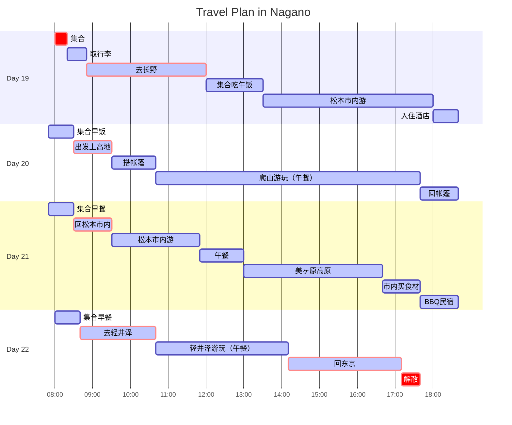

```mermaid
gantt
    dateFormat HH:mm
    axisFormat %H:%M
    title                     Travel Plan in Nagano 
    section Day 19
    集合               : crit, fday1, 08:00, 20m
    取行李             : active, fday2, after fday1, 30m
    去长野             : crit, active, fday3, after fday2, 190m
    集合吃午饭         : active, fday4, after fday3, 90m
    松本市内游         : active, fday5, after fday4, 270m
    入住酒店           : active, fday6, after fday5, 40m

    section Day 20
    集合早饭           : active, sday1, 07:50, 40m
    出发上高地         : crit, active, sday2, after sday1, 60m
    搭帐篷             : active, sday3, after sday2, 70m
    爬山游玩（午餐）    : active, sday4, after sday3, 7h
    回帐篷         : active, sday5, after sday4, 1h
    
    section Day 21
    集合早餐           : active, tday1, 07:50, 40m
    回松本市内         : crit, active, tday2, after tday1, 60m
    松本市内游         : active, tday3, after tday2, 140m
    午餐              : active, tday4, after tday3, 70m
    美ヶ原高原         : active, tday5, after tday4, 220m
    市内买食材         : active, tday6, after tday5, 60m
    BBQ民宿           : active, tday7, after tday6, 60m

    section Day 22
    集合早餐           : active, foday1, 08:00, 40m
    去轻井泽           : crit, active, foday2, after foday1, 120m
    轻井泽游玩（午餐）  : active, foday3, after foday2, 210m
    回东京             : crit, active, foday4, after foday3, 180m
    解散              : crit, foday5, after foday4, 30m
```
